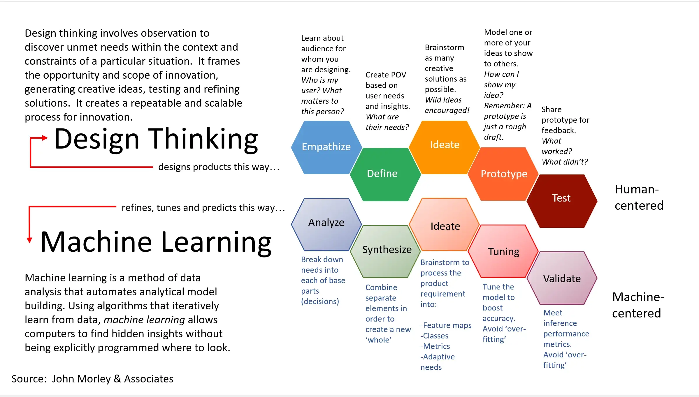

# ITSRio-TCC
ITSRio TCC (Trabalho de Conclusão de Curso) - Computação - Capstone Project

Pós-graduação em Direito Digital - ITSRio - UERJ

- https://itsrio.org/pt/cursos/pos-graduacao/

Orientação de TCC - Pós-Gratuação

Professores: https://itsrio.org/wp-content/uploads/2021/10/professores-positsuerj_2021.2.pdf

# Processos

1. Ciências dos Dados, em 5 etapas:

2. Wolfram Multiparadigm Data Science, em 5 etapas:

- https://www.mpdatascience.com/MultiparadigmDataScienceBrochure.pdf

3. Metodologia científica:

Pesquisa científica:

- Resumo do assunto: estabelecer hipótese (SME - Subject-matter expert)
- Pesquisa bibliográfica
- Pesquisa experimental (Ciências dos Dados)
  - Dados
  - Modelagem matemática/estatística/computacional
      - IA (Inteligência Artificial)
      - ML (Machine Learning - Aprendizagem de Máquina)
  - Validação da hipótese

4. Design Thinking & Machine Learning (IA)

Fonte: https://www.datasciencecentral.com/design-thinking-future-proof-yourself-from-ai/

# TCC

Principais etapas do TCC com base em Ciências dos Dados (computação) e a metodologia científica, para graduação ou pós-graduação:

1. Estabelecer questão de pesquisa - estabelecer hipótese (ASK/QUESTION) - EMPATIZAR
2. Identificar e obter fontes de dados (GET/WRANGLE) - DEFINIR
3. Combinar e limpar dados (EXPLORE/EXPLORE) - IDEAR
4. Modelar - validar hipótese - algoritmos e IA/ML, math/estatística (MODEL/ANALYZE) - PROTOTIPAR
5. Visualizar e reportar (COMMUNICATE/COMMUNICATE) - TESTAR/PROBAR

View as a table:

| Etapa | Metodologia Científica (Descrição) | Data Science | Multiparadigm Data Science (Wolfram) | Design Thinking |
|---	|---	|---	|---	|--- |
| 1 | Estabelecer questão de pesquisa - estabelecer hipótese | ASK | QUESTION | EMPATIZAR |
| 2 | Identificar e obter fontes de dados | GET | WRANGLE | DEFINIR |
| 3 | Combinar e limpar dados | EXPLORE | EXPLORE | IDEAR |
| 4 | Modelar - validar hipótese - algoritmos e IA/ML, math/estatística | MODEL | ANALYZE | PROTOTIPAR | 
| 5 | Visualizar e reportar | COMMUNICATE | COMMUNICATE | TESTAR | PROBAR | 

Cronograma (exemplo):

1. 1 semana (7 dias)
    - Estabelecer questão de pesquisa
    - Estabelecer hipótese
    - Definir cronograma
    - Estudar bibliografia recomendada (abaixo) 
3. 2 semanas (14 dias)
    - Identificar e obter **fonte de dados**
5. 6 semanas (30 dias)
6. 2 semanas (14 dias)
7. 1 semana (7 dias)

SIGILO: Dados sensíveis como nome, endereço, empresa, juízes, geo localização, etc... podem ser omitidos os mascarados para evitar conflitos com a LGPD. Informações como sexo, idade, cidade, entre outros são importantes para a pesquisa (meta dados).

Esforço no processo de Ciências dos Dados: 
&emsp;◼ 80% do trabalho: Questionar (escopo), Garimpar dados e Explorar 
&emsp;◼ 20% do trabalho: Modelagem (IA, ML) e Comunicação 

# Vídeos rápidos online - Treinamento

Stephen Wolfram Explains How Smart Contracts Will Work (6 min)
- https://www.youtube.com/watch?v=IddTrcE5Qwo

What is a neural net exactly? (6 min)
- https://www.youtube.com/watch?v=IH4bdPxscyo

Inteligência Artificial | Expresso Futuro Com Ronaldo Lemos (30 min)
- https://www.youtube.com/watch?v=CM5_epaUje8

What's Cooking: Creating a Data Science Pipeline for Recipe Classification (35 min)
- https://www.wolfram.com/wolfram-u/catalog/dat004/

Multiparadigm Data Science (4 horas)
- https://www.wolfram.com/wolfram-u/multiparadigm-data-science/

The Multiparadigm Data Science Workflow (3 horas)
- https://www.wolfram.com/wolfram-u/catalog/dat103/

Extra (opcional):

An Elementary Introduction to the Wolfram Language (6 horas)
- https://www.wolfram.com/wolfram-u/an-elementary-introduction-to-the-wolfram-language/

# Ferramentas

Wolfram Cloud
  - https://www.wolframcloud.com/ 

Wolfram Language
  - https://www.wolfram.com/language/

Mathematica
  - https://www.wolfram.com/mathematica/

# Dicas
<!--
<blockquote class="twitter-tweet">
12 perguntas do artigo científico Responder a essas 12 perguntas pode ajudar a estruturar seu raciocínio, tirar dúvidas que surgem durante sua elaboração e ainda para sair daquele bloqueio que SEMPRE chega, mais cedo ou mais tarde. Saiba mais: <a href="https://t.co/BVcoYJth0h">https://t.co/BVcoYJth0h</a><a href="https://twitter.com/aguiausp?ref_src=twsrc%5Etfw">@aguiausp</a> <a href="https://t.co/4SbxhlJKwC">pic.twitter.com/4SbxhlJKwC</a>
&mdash; AGUIA (@aguiausp) <a href="https://twitter.com/aguiausp/status/1539706321439793152?ref_src=twsrc%5Etfw">June 22, 2022</a></blockquote> 
-->

# Bibliografia

1. *Metodologia Científica* by Amado L. Cervo, Pedro A. Bervian, Roberto da Silva

2. *Introduction to Machine Learning* by Etienne Bernard, 2022:
    - https://www.wolfram.com/language/introduction-machine-learning/

3. *Beginning Mathematica and Wolfram for Data Science: Applications in Data Analysis*, Machine Learning, and Neural Networks by Jalil Villalobos Alva, 2021

4. *Elementary Introduction to Wolfram Language* by Stephen Wolfram:
    - https://www.wolfram.com/language/elementary-introduction/2nd-ed/

5. *Inteligência artificial: avanços e tendências* by Fabio G. Cozman, Guilherme Ary Plonski, Hugo Neri, USP, Instituto de Estudos Avançados, 2021
    - https://jornal.usp.br/cultura/inteligencia-artificial-ganha-e-book-multidisciplinar/

6. *Hands-on Start to Wolfram Mathematica and
Programming with the Wolfram Language* by Cliff Hastings, Kelvin Mischo, Michael Morrison, Third Edition, Wolfram Media, 2020

7. *Code: The Hidden Language of Computer Hardware and Sofware* by Charles Petzold, Microsoft
Press, 2000

8. *Inteligência Artificial e Big Data* by Chiara de Teffé e Sérgio Branco, ITS Rio, 2022
    - https://itsrio.org/pt/publicacoes/inteligencia-artificial-e-big-data/
    
9. *A Magia do Design Thinking: Um kit de ferramentas para o crescimento rápido da sua empresa*, Jeanne Liedtka, Tim Ogilvie, Atlas Book, 2019

10. *Sprint: How to Solve Big Problems and Test New Ideas in Just Five Days*, Jake Knapp, John Zeratsky, Simon & Schuster, 2016
    - https://www.thesprintbook.com/

11. *What Is ChatGPT Doing ... and Why Does It Work?*, Stephen Wolfram, 2023
    - https://www.amazon.com/What-ChatGPT-Doing-Does-Work/dp/1579550819

Extra:

1. Lawgorithm IA & Direito: https://lawgorithm.com.br/projeto/ia-direito/

2. Coded Bias, 2020, 1 h 26 min: https://www.imdb.com/title/tt11394170/

3. Terms and Conditions May Apply, 2013, 1 h 19 min: https://www.imdb.com/title/tt2084953/

4. The Great Hack, 2019, 1 h 54 min: https://www.imdb.com/title/tt4736550/

5. MIT's Moral Machine: http://moralmachine.mit.edu

 

